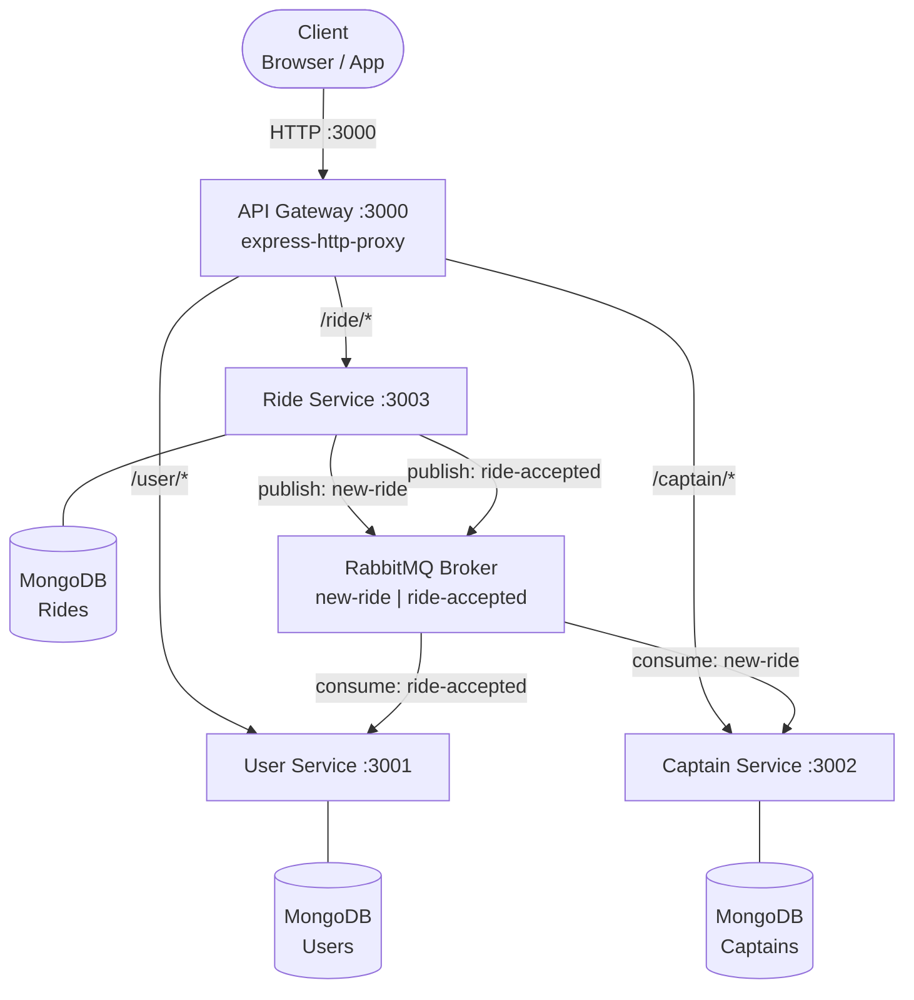
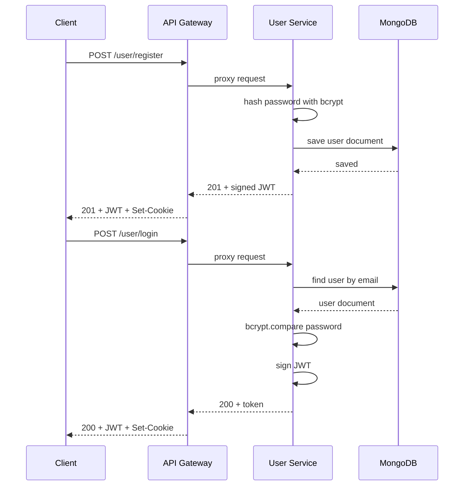
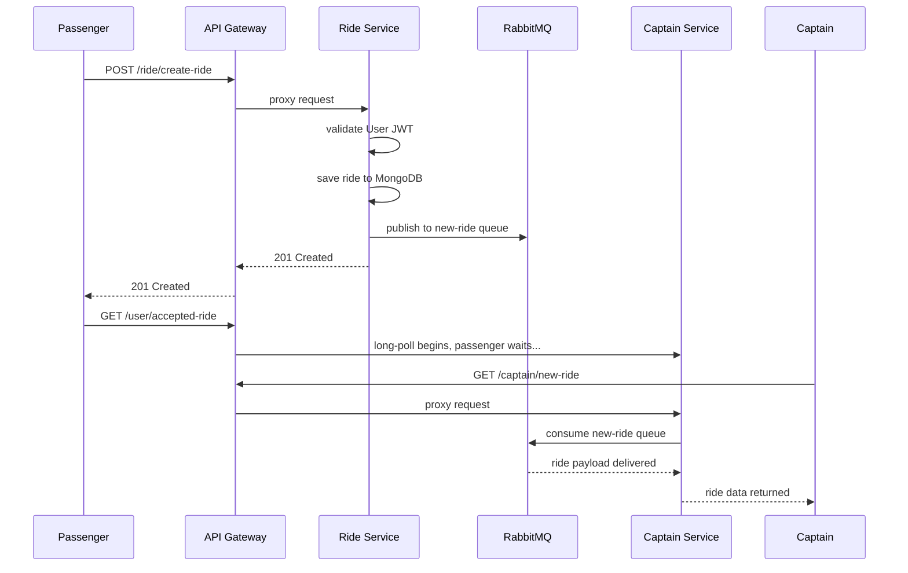
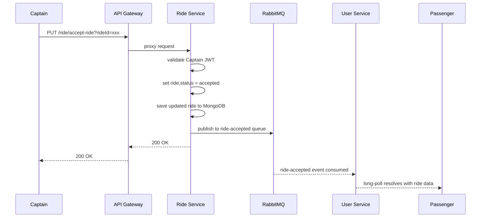
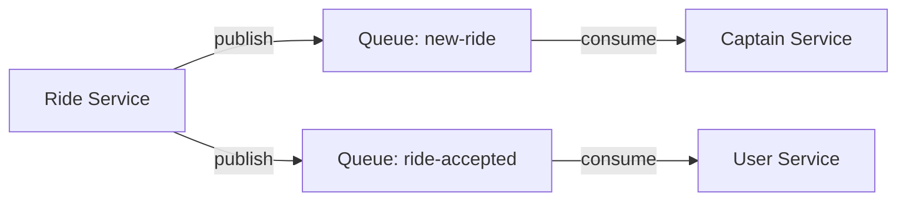

<div align="center">

# 🚗 Uber — Micro-Services Architecture

**A production-inspired ride-hailing backend built with a clean microservices pattern.**
Decoupled services, async messaging, JWT auth, and a single API Gateway — all in Node.js + ES Modules.

[](https://nodejs.org/)
[](https://expressjs.com/)
[](https://mongoosejs.com/)
[](https://www.rabbitmq.com/)
[](https://jwt.io/)
[](https://nodejs.org/api/esm.html)

</div>

---

## 📑 Table of Contents

- [Overview](#-overview)
- [Tech Stack](#-tech-stack)
- [Architecture](#-architecture)
- [Services](#-services)
- [API Reference](#-api-reference)
- [Workflows](#-workflows)
- [Message Queues](#-message-queues-rabbitmq)
- [Environment Variables](#-environment-variables)
- [Getting Started](#-getting-started)
- [Project Structure](#-project-structure)

---

## 🧭 Overview

This project implements a **real-world microservices backend** for a ride-hailing platform modelled after Uber. Each domain (users, captains/drivers, rides) is an **independently deployable Node.js service** that communicates over both **HTTP (via API Gateway)** and **asynchronous message queues (RabbitMQ)**.

Key architectural highlights:

- 🏗️ **4 independent services** — Gateway, User, Captain, Ride
- 🔀 **Event-driven messaging** via RabbitMQ (AMQP) for real-time ride dispatching
- 🔐 **JWT-based authentication** with cookie support and token blacklisting
- 📡 **Long-polling** for real-time ride notifications (no WebSocket needed)
- 🗄️ **MongoDB** with Mongoose ODM per service (shared-nothing persistence)
- 📦 **ES Modules** (`"type": "module"`) throughout every service

---

## 🛠️ Tech Stack

| Layer | Technology | Purpose |
|---|---|---|
| **Runtime** |  | JavaScript server runtime |
| **Framework** |  | HTTP server and routing |
| **Database** |  | Document store per service |
| **ODM** |  | Schema modeling and validation |
| **Messaging** |  | Async inter-service events (AMQP) |
| **Auth** |  | Stateless authentication |
| **Password** |  | Password hashing |
| **Proxy** | `express-http-proxy` | Gateway reverse proxy |
| **HTTP Client** |  | Inter-service HTTP calls (Ride) |
| **Dev Server** |  | Hot-reload during development |
| **Modules** | ES Modules (`import`/`export`) | Native module system |

---

## 🏗️ Architecture



---

## 📦 Services

### 🌐 API Gateway `(port 3000)`

The single entry point for all client requests. Uses `express-http-proxy` to transparently forward requests to the appropriate downstream service. No business logic lives here.

| Path Prefix | Proxied To |
|---|---|
| `/user/*` | User Service `:3001` |
| `/captain/*` | Captain Service `:3002` |
| `/ride/*` | Ride Service `:3003` |

---

### 👤 User Service `(port 3001)`

Manages **passenger** accounts and handles real-time ride notifications via long-polling.

**Stack:** Express 5 · Mongoose · JWT · bcrypt · RabbitMQ (amqplib) · cookie-parser

**Responsibilities:**
- Register and authenticate passengers
- Serve authenticated profile data
- Subscribe to the `ride-accepted` queue and hold long-poll connections until a captain accepts a ride

---

### 🚖 Captain Service `(port 3002)`

Manages **driver** accounts, their availability status, and surfaces incoming ride requests via long-polling.

**Stack:** Express 5 · Mongoose · JWT · bcrypt · RabbitMQ (amqplib) · cookie-parser

**Responsibilities:**
- Register and authenticate captains (drivers)
- Toggle availability status (available / unavailable)
- Subscribe to the `new-ride` queue and hold long-poll connections until a new ride is dispatched

---

### 🛣️ Ride Service `(port 3003)`

The core **ride orchestration** service. Creates ride documents and publishes events to RabbitMQ.

**Stack:** Express 4 · Mongoose · JWT · RabbitMQ (amqplib) · Axios · cookie-parser

**Responsibilities:**
- Create ride requests (validates user JWT)
- Publish `new-ride` events so Captain service can dispatch
- Accept rides (validates captain JWT)
- Publish `ride-accepted` events so User service can resolve long-polls
- Update ride status in MongoDB

---

## 📡 API Reference

### 👤 User Endpoints `(via Gateway: /user/*)`

| Method | Route | Auth | Description |
|---|---|---|---|
| `POST` | `/user/register` | Public | Register a new passenger |
| `POST` | `/user/login` | Public | Authenticate and receive JWT |
| `POST` | `/user/logout` | Public | Logout and blacklist token |
| `GET` | `/user/profile` | 🔒 User JWT | Get own profile |
| `GET` | `/user/accepted-ride` | 🔒 User JWT | Long-poll — wait for ride acceptance |

**Register body:**
```json
{ "name": "string", "email": "string", "password": "string" }
```

**Login body:**
```json
{ "email": "string", "password": "string" }
```

---

### 🚖 Captain Endpoints `(via Gateway: /captain/*)`

| Method | Route | Auth | Description |
|---|---|---|---|
| `POST` | `/captain/register` | Public | Register a new captain |
| `POST` | `/captain/login` | Public | Authenticate and receive JWT |
| `POST` | `/captain/logout` | Public | Logout and blacklist token |
| `GET` | `/captain/profile` | 🔒 Captain JWT | Get own profile |
| `PATCH` | `/captain/toggle-availability` | 🔒 Captain JWT | Toggle available / unavailable |
| `GET` | `/captain/new-ride` | 🔒 Captain JWT | Long-poll — wait for a ride request |

---

### 🛣️ Ride Endpoints `(via Gateway: /ride/*)`

| Method | Route | Auth | Description |
|---|---|---|---|
| `POST` | `/ride/create-ride` | 🔒 User JWT | Create a new ride request |
| `PUT` | `/ride/accept-ride?rideId=<id>` | 🔒 Captain JWT | Accept a pending ride |

**Create ride body:**
```json
{ "pickup": "string", "destination": "string" }
```

---

## 🔄 Workflows

### 🔐 User Registration and Login Flow



---

### 🚕 Ride Request Flow



---

### 🚗 Ride Acceptance Flow



---

## 📨 Message Queues (RabbitMQ)

| Queue | Producer | Consumer | Payload |
|---|---|---|---|
| `new-ride` | Ride Service | Captain Service | `JSON.stringify(ride)` |
| `ride-accepted` | Ride Service | User Service | `JSON.stringify(ride)` |

Both queues are **asserted on use** (auto-created if not present) and use **manual acknowledgement** (`channel.ack`) for at-least-once delivery.



---

## 🔑 Environment Variables

Each service has its own `.env` file. Below are the expected keys:

### User and Captain Services
```env
PORT=3001
MONGO_URI=mongodb://localhost:27017/uber-users
JWT_SECRET=your_jwt_secret_here
RABBIT_URL=amqp://localhost
```

### Ride Service
```env
PORT=3003
MONGO_URI=mongodb://localhost:27017/uber-rides
JWT_SECRET=your_jwt_secret_here
RABBIT_URL=amqp://localhost
```

---

## 🚀 Getting Started

### Prerequisites

| Dependency | Version | Download |
|---|---|---|
|  | >= 18.x | [nodejs.org](https://nodejs.org) |
|  | >= 6.x | [mongodb.com](https://www.mongodb.com) |
|  | >= 3.x | [rabbitmq.com](https://www.rabbitmq.com) |

### Installation and Running

Open **4 separate terminals** and run each service:

```bash
# Terminal 1 - API Gateway (port 3000)
cd gateway && npm install && npm run dev

# Terminal 2 - User Service (port 3001)
cd user && npm install && npm run dev

# Terminal 3 - Captain Service (port 3002)
cd captain && npm install && npm run dev

# Terminal 4 - Ride Service (port 3003)
cd ride && npm install && npm run dev
```

All requests flow through the single gateway entry point:

```
http://localhost:3000
```

---

## 🗂️ Project Structure

```
Uber - Micro-Services/
|
+-- gateway/
|   +-- app.js                       Express proxy rules + server entry
|   +-- package.json
|
+-- user/
|   +-- app.js                       Express setup + RabbitMQ init
|   +-- server.js                    HTTP server entry point
|   +-- controllers/
|   |   +-- user.controller.js       register, login, logout, profile, acceptedRide
|   +-- routes/
|   |   +-- user.router.js           Route definitions
|   +-- models/
|   |   +-- user.model.js            Mongoose user schema
|   +-- middleware/
|   |   +-- authMiddleware.js        userAuth JWT middleware
|   +-- service/
|   |   +-- rabbit.js                RabbitMQ connect / publish / subscribe
|   +-- db/db.js                     MongoDB connection
|   +-- .env
|
+-- captain/
|   +-- app.js                       Express setup + RabbitMQ init
|   +-- server.js                    HTTP server entry point
|   +-- controllers/
|   |   +-- captain.controller.js    register, login, logout, profile, toggleAvailability, waitForNewRide
|   +-- routes/
|   |   +-- captain.router.js        Route definitions
|   +-- models/
|   |   +-- captain.model.js         Mongoose captain schema
|   +-- middleware/
|   |   +-- authMiddleware.js        captainAuth JWT middleware
|   +-- service/
|   |   +-- rabbit.js                RabbitMQ connect / publish / subscribe
|   +-- db/db.js                     MongoDB connection
|   +-- .env
|
+-- ride/
|   +-- app.js                       Express setup + RabbitMQ init
|   +-- server.js                    HTTP server entry point
|   +-- controllers/
|   |   +-- ride.controller.js       createRide, acceptRide
|   +-- routes/
|   |   +-- ride.route.js            Route definitions
|   +-- model/
|   |   +-- ride.model.js            Mongoose ride schema
|   +-- middleware/
|   |   +-- auth.middleware.js       userAuth + captainAuth JWT middleware
|   +-- service/
|   |   +-- rabbit.js                RabbitMQ connect / publish / subscribe
|   +-- db/db.js                     MongoDB connection
|   +-- .env
|
+-- README.md
```

---

<div align="center">

Built with ❤️ as a learning project to explore **microservices**, **event-driven architecture**, and **Node.js ES Modules**.

</div>
